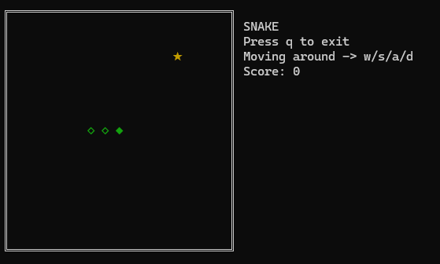
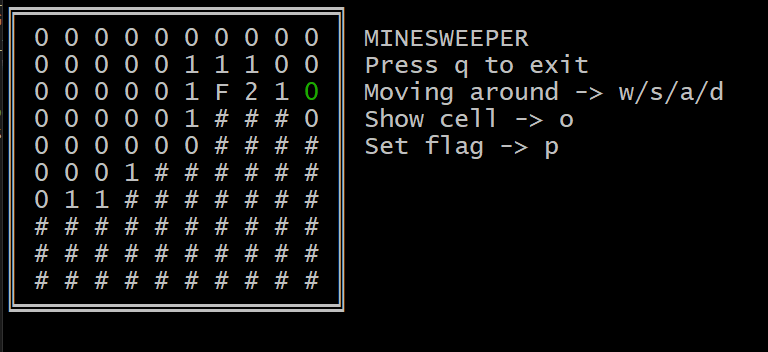

The project aims to showcase the possibilities of programming in scripting languages (Bash and Perl) by implementing two classic games: Snake and Minesweeper.

The games demonstrate the use of raw terminal mode, cursor manipulation, colored terminal output, and UNICODE characters (game borders, snake, and collectible object for the snake).

Files included in the project

- `readme.md` - instructions about the project and how to run it,
- `snake.pl` - implementation of the Snake game in Perl,
- `minesweeper.sh` - implementation of the Minesweeper game in Bash.

## Installation and Running

1. Ensure the required interpreters are installed on your system:

- Perl (for Snake),
- Bash (for Minesweeper).

2. Assign executable permissions to the files:

- `chmod +x snake.pl minesweeper.sh`

To display instructions for the games, run the program with the -h option:

- `./snake.pl -h`
- `./minesweeper.sh -h`

To play, run them without any  options.

  
## Game Rules and Controls

### Snake

The goal of the game is to collect as many objects as possible.
You can control the snake using the keys:

- `w` (up),
- `a` (left),
- `s` (down),
- `d` (right).

The snake initially has a length of 3 and grows by 1 with each collected object.
The game ends if the snake hits a wall or itself.

  
### Minesweeper

The game consists of hidden cells, some of which contain bombs.
The goal is to uncover all cells that are not bombs.
Bombs are denoted as 9.
Each cell provides information about the number of bombs in its neighbourhood (from 0 to 8), where neighbors are cells whose coordinates differ by at most 1.

You can navigate the grid using the keys:

- `w` (up),
- `a` (left),
- `s` (down),
- `d` (right).

  
Press `o` to uncover the selected cell.
Press `p` to place a flag on the selected cell; to uncover a flagged cell, remove the flag by pressing `p` again.

You can exit the game at any time in both cases by pressing the `q` key.

## Notes

- When starting, the games will ask the user to provide gameplay parameters:

- For Snake, only the board size is required (it is square), with valid values in the range [10, 30].
	- For Minesweeper, the parameters are:
	- number of rows [5, 30],
	- number of columns [5, 30],
	- number of bombs [1, (number_of_cells-1)].
	
These parameters allow the creation of a rectangular game board and adjustment of difficulty by setting the number of bombs.

The Snake game’s speed is controlled by the `SELECT` function, which monitors file descriptors (including `STDIN`).  
Holding down a key to change the snake's direction will cause it to move faster.  
Correct gameplay involves pressing keys individually, but holding them down allows for faster play.